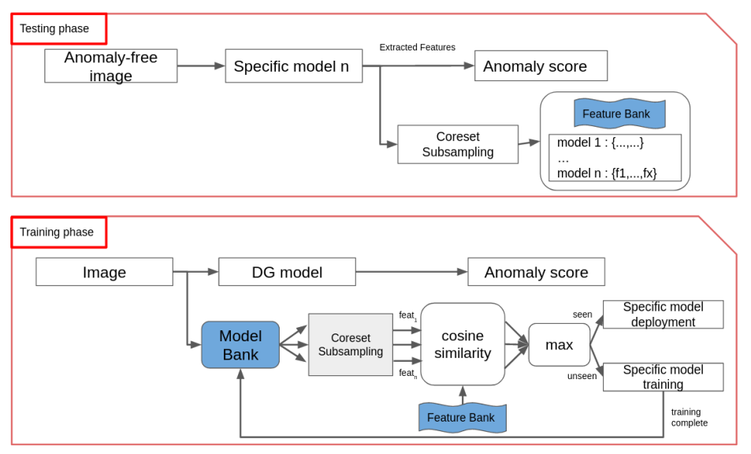

<p align="center">
  <h1><center>	&#127981;&#x1F455; FABLE &#x1F456;&#127981;</center></h1>
</p>

## Official implementation of the paper : "FABLE : Fabric Anomaly Detection Automation Process"
Article : https://arxiv.org/pdf/2306.10089.pdf


<p align="center">
  
</p>


## Getting Started

You will need [Python 3.10+](https://www.python.org/downloads) and the packages specified in _requirements.txt_.

Install packages with:

```
$ pip install -r requirements.txt
```

## Configuration File (config.yaml)

This file allows configuring the main elements of the project.

- `imageSize` (INT): the size of the images for processing (input to the model)
- `bigModel` (STR): the name of the model that infers on the resized image (/2) and in the decision class
- `smallModel` (STR): the name of the model that infers on full-size patches and in the precise decision class
- `data_path` (STR): the path to the data (datasets and model weights)
- `half` (BOOL): to specify if only half of the image is processed (taking the center on Y)
- `smallModelName` (STR): the backbone used for the smallModel
- `bigModelName` (STR): the backbone used for the bigModel
- `out_indicesSmallModel` (LIST OF INT): the list of indices of the layers used for the small model (if using timm)
- `out_indicesBigModel` (LIST OF INT): the list of indices of the layers used for the big model (if using timm)
- `perinNoise_path` (STR): the path to the dtd dataset for defect generation
- `phase` (STR): the processing phase, not very useful -> to remove
- `preciseDetThresh` (FLOAT): the threshold for precise detection
- `fastProcess` (BOOL): to enable or disable fast processing (no overlap between patches and potential loss of image parts)
- `processType` (STR): for video processing and training on video (directory only for now)
- `video_path` (STR): path to videos for processing and training
- `vis` (BOOL): if we want to visualize segmentation during training
- `overlap` (INT): if we want overlap between patches in number of pixels

- `dbHost` (STR): Database IP
- `localdbName` (STR): Table name
- `localusrName` (STR): User identifier
- `localusrPwd` (STR): User password

- `cti` (STR): Path to the .cti file corresponding to the camera
- `exposure` (INT): Camera exposure time
- `height` (INT): Camera dimension (height)
- `width` (INT): Camera dimension (width)

## Function Usage   
The main functions of the project are as follows:

### trainingPhase.py  
This function allows starting training from either a folder of videos or images currently retrieved by the camera (not yet functional) ==> in the future, it will be used in parallel with processing to train the model specific to the current fabric.

### traitementGenicam.py  
This function performs processing on the current stream retrieved by the camera (genicam-compatible). For now, it only works on the type defined in the configuration file. In the future, it will work on the general model and then switch to the specific model once training is completed.

### traitementVideo.py
This function performs processing on a folder (for testing or catching up on untreated fabric).


## Citation
Please cite our paper in your publications if it helps your research. Even if it does not, you are welcome to cite us.

    @inproceedings{thomine2023fable,
    title={FABLE: Fabric Anomaly Detection Automation Process},
    author={Thomine, Simon and Snoussi, Hichem and Soua, Mahmoud},
    booktitle={2023 International Conference on Control, Automation and Diagnosis (ICCAD)},
    pages={1--6},
    year={2023},
    organization={IEEE}
    }


## License

This project is licensed under the MIT License.